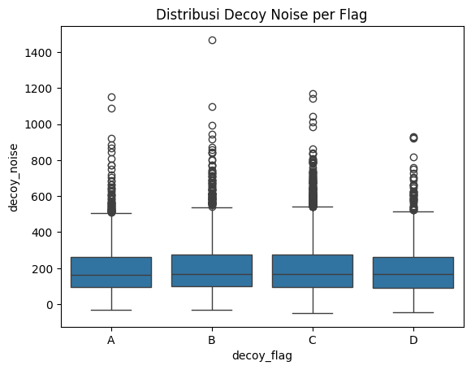

## Anomaly Detection Findings – e_commerce_transactions Dataset 

Berdasarkan analisis kolom `decoy_flag` dan `decoy_noise`, saya mengidentifikasi dua anomali utama:

1. **Nilai Negatif pada Semua Flag**  
   Semua kategori `decoy_flag` (A–D) memiliki nilai minimum `decoy_noise` negatif. Ini tidak umum, karena noise umumnya diharapkan bernilai positif.

2. **Outlier Ekstrem**  
   Terdapat outlier signifikan, dengan nilai maksimum mencapai lebih dari 1400 sementara median hanya di kisaran 160-an. Boxplot menunjukkan bahwa hampir semua flag memiliki outlier dengan `noise` > 500.

### Statistik Ringkasan per `decoy_flag`

| Flag | Count | Mean     | Std Dev  | Min    | 25%    | 50%    | 75%    | Max     |
|------|-------|----------|----------|--------|--------|--------|--------|---------|
| A    | 1486  | 196.77   | 144.49   | -31.23 | 96.40  | 162.19 | 261.73 | 1153.43 |
| B    | 2519  | 201.59   | 148.48   | -33.10 | 97.48  | 166.72 | 274.62 | 1468.46 |
| C    | 4936  | 202.78   | 146.08   | -48.34 | 97.20  | 169.26 | 274.67 | 1170.73 |
| D    | 1059  | 198.25   | 146.16   | -45.48 | 92.22  | 166.84 | 262.54 | 928.90  |

### Visualisasi

